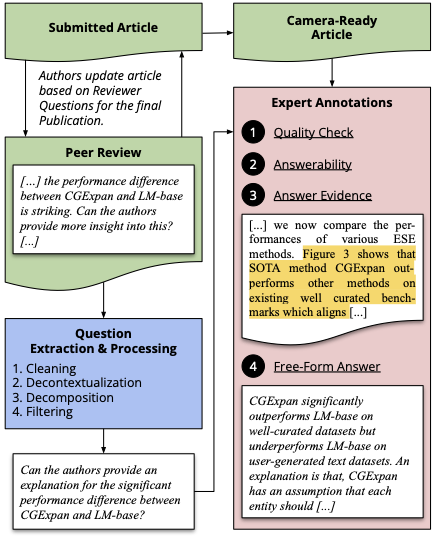

<div align="center">
<h1>PeerQA: A Scientific Question Answering Dataset from Peer Reviews</h1>

[](http://arxiv.org/abs/2502.13668)
[](https://huggingface.co/datasets/UKPLab/PeerQA)
[](https://opensource.org/licenses/Apache-2.0)
[](https://www.python.org/)

</div>


We present PeerQA, a real-world, scientific, document-level Question Answering (QA) dataset. PeerQA questions have been sourced from peer reviews, which contain questions that reviewers raised while thoroughly examining the scientific article. Answers have been annotated by the original authors of each paper. The dataset contains 579 QA pairs from 208 academic articles, with a majority from ML and NLP, as well as a subset of other scientific communities like Geoscience and Public Health. 
PeerQA supports three critical tasks for developing practical QA systems: Evidence retrieval, unanswerable question classification, and answer generation. 
We provide a detailed analysis of the collected dataset and conduct experiments establishing baseline systems for all three tasks. Our experiments and analyses reveal the need for decontextualization in document-level retrieval, where we find that even simple decontextualization approaches consistently improve retrieval performance across architectures. On answer generation, PeerQA serves as a challenging benchmark for long-context modeling, as the papers have an average size of 12k tokens.

## News

✨ _2025/04/24_ **Outstanding Paper at NAACL** - PeerQA won the [Outstanding Paper Award](https://2025.naacl.org/blog/best-papers/#outstanding-papers) at NAACL 2025!

✨ _2025/03/04_ **HuggingFace Datasets** - The PeerQA dataset is now available on HuggingFace Datasets! Find detailed instructions on https://huggingface.co/datasets/UKPLab/PeerQA.

✨ _2025/02/25_ **New DeepSeek-R1 & Cross-Encoder Results** - We add results for the distilled DeepSeek-R1 models: Llama 8B, Qwen 7B, Qwen 14B and Qwen 32B for the answerability, and answer generation tasks. We furhter evaluate a new set of Dense and Cross-Encoder Reranker models. See [Additional Results](#additional-results) for more details.

✨ _2025/02/19_ **PeerQA Dataset Released** - The PeerQA preprint is now available on [Arxiv](http://arxiv.org/abs/2502.13668), as well as the code and data on [GitHub](https://github.com/UKPLab/peerqa).

✨ _2025/01/23_ **PeerQA accepted at NAACL** - The PeerQA paper has been accepted to NAACL 2025. The paper will be presented at the conference in April/May 2025.

## Setup

To run the experiments, you need to install the following dependencies:

- [GROBID 0.8](https://github.com/kermitt2/grobid/releases/tag/0.8.0)
- Java 21 (for BM25 retrieval experiments with pyserini)
- [uv](https://docs.astral.sh/uv/)
To set up the environment, you can use the following commands:

```bash
# download python version with uv
uv python install 3.10
# create a virtual environment
uv venv .venv
# activate the virtual environment
source .venv/bin/activate
# install the required python packages
uv pip install .
```

To process the data locally, you need to run GROBID 0.8.0. By default, the preprocessing script will use GROBID hosted on HuggingFace's Spaces (https://timbmg-peerqa-grobid-0-8-0.hf.space).

- [GROBID 0.8](https://github.com/kermitt2/grobid/releases/tag/0.8.0)

For the BM25 experiments with Pyserini you need:

- Java 21

## Data & Preprocessing

This section describes how to download the data from the different sources and how to preprocess it for the experiments.

### Questions

1. Create a new directory `data` and download and unzip the questions into it

#### Linux/Mac
```bash
mkdir data && cd data && curl -L 'https://tudatalib.ulb.tu-darmstadt.de/bitstream/handle/tudatalib/4467/peerqa-data-v1.0.zip?sequence=1&isAllowed=y' -o peerqa-data-v1.0.zip && unzip peerqa-data-v1.0.zip && rm peerqa-data-v1.0.zip && cd ..
```

#### Windows
```powershell
mkdir data
cd data
Invoke-WebRequest -Uri 'https://tudatalib.ulb.tu-darmstadt.de/bitstream/handle/tudatalib/4467/peerqa-data-v1.0.zip?sequence=1&isAllowed=y' -OutFile 'peerqa-data-v1.0.zip'
Expand-Archive -LiteralPath '.\peerqa-data-v1.0.zip' -DestinationPath '.'
Remove-Item 'peerqa-data-v1.0.zip'
cd ..
```

### Papers

To adhere to the licenses of the papers, we cannot provide the papers directly. Instead, we provide the steps to download the papers from the respective sources and extract the text from them.

#### Download OpenReview PDFs and Extract Text

1. Download PDFs from OpenReview for ICLR 2022, ICLR 2023, NeurIPS:

```bash
uv run download_openreview.py
```

2. Extract the text from the PDFs to add OpenReview PDF texts to `data/papers.jsonl`. The text is extracted from the PDF with GROBID 0.8.0. By default the script will use the GROBID server hosted on HuggingFace spaces at https://timbmg-peerqa-grobid-0-8-0.hf.space. However, you can also run the GROBID server locally via docker: `docker run -p 8070:8070 lfoppiano/grobid:0.8.0`. To use the local server, set the `--grobid_server` argument to `http://localhost:8070`. Otherwise, the script will use the HuggingFace server. To now extract the text from the PDFs, run:

```bash
uv run extract_text_from_pdf.py
```

Now, the data is ready for the experiments.

### Data

Once the download and preprocessing steps are completed, the following files should be present in the `data` directory:

- papers.jsonl
- qa.jsonl
- qa-augmented-answers.jsonl
- qa-unlabeled.jsonl

#### Paper Data

| Key          | Type | Description                                                                                                                                                                                                                                     |
| ------------ | ---- | ----------------------------------------------------------------------------------------------------------------------------------------------------------------------------------------------------------------------------------------------- |
| idx          | int  | The index of the paper in the dataset                                                                                                                                                                                                           |
| pidx         | int  | The index of the paragraph in the paper                                                                                                                                                                                                         |
| sidx         | int  | The index of the sentence in the paragraph                                                                                                                                                                                                      |
| type         | str  | The type of the content (e.g., title, heading, caption)                                                                                                                                                                                         |
| content      | str  | The content of the paragraph                                                                                                                                                                                                                    |
| last_heading | str  | The last heading before the paragraph                                                                                                                                                                                                           |
| paper_id     | str  | The unique identifier of the paper, where the first part is the source of the paper (e.g., openreview, egu, nlpeer) and the second part is the venue (e.g. ICLR-2022-conf, ESurf, ESD), and the third part is a unique identifier for the paper |

#### QA Data

| Key                    | Type                                   | Description                                                                                                                                                                           |
| ---------------------- | -------------------------------------- | ------------------------------------------------------------------------------------------------------------------------------------------------------------------------------------- |
| paper_id               | str                                    | The unique identifier of the paper; see above for composition                                                                                                                         |
| question_id            | str                                    | The unique identifier of the question                                                                                                                                                 |
| question               | str                                    | The question                                                                                                                                                                          |
| raw_answer_evidence    | List[str]                              | The raw evidence that has been highlighed in the PDF by the authors                                                                                                                   |
| answer_evidence_sent   | List[str]                              | The evidence sentences that have been extracted from the raw evidence                                                                                                                 |
| answer_evidence_mapped | List[Dict[str, Union[str, List[int]]]] | The evidence sentences with the corresponding indices in the paper. If a sentence corresponds to multiple sentences in the papers.jsonl file, multiple indices will be provided here. |
| answer_free_form       | str                                    | The free-form answer provided by the authors                                                                                                                                          |
| answerable             | bool                                   | Whether the question is answerable according to the authors                                                                                                                           |
| answerable_mapped      | bool                                   | Whether the question is answerable according to the authors and it has_mapped_ evidence                                                                                             |

## Retrieval

This section describes how to run the retrieval experiments for the PeerQA dataset. We provide the scripts for the Dense & Cross-Encoder, BM25, and ColBERT retrieval models.

### Preprocessing

1. Create the qrels file for sentence-level and paragraph-level retrieval

```bash
uv run retrieval_create_qrels.py
```

### Dense & Cross-Encoder

The following table provides an overview of the models used for the retrieval experiments along with their respective configurations.

To reproduce the decontextualization experiments, add a `--template` argument to the scripts. In the paper, we used `--template="Title: {title} Paragraph: {content}"` for paragraph chunks (i.e. `--granularity=parapgraphs`) and `--template="Title: {title} Sentence: {content}"` for sentence chunks (i.e. `--granularity=sentences`).

| Query Model                           | Document Model                       | Model Class | Similarity Function | Pooling      |
| ------------------------------------- | ------------------------------------ | ----------- | ------------------- | ------------ |
| facebook/contriever                   | -                                    | hf          | dot                 | mean_pooling |
| facebook/contriever-msmarco           | -                                    | hf          | dot                 | mean_pooling |
| facebook/dragon-plus-query-encoder    | facebook/dragon-plus-context-encoder | hf          | dot                 | first_token  |
| sentence-transformers/gtr-t5-xl       | -                                    | st          | dot                 | mean_pooling |
| naver/splade-v3                       | -                                    | splade      | dot                 | splade       |
| cross-encoder/ms-marco-MiniLM-L-12-v2 | -                                    | cross       | cross               | -            |

1. Run the retrieval

```bash
uv run retrieval_dense_cross_retrieval.py --query_model=facebook/contriever-msmarco --model_cls=hf --sim_fn=dot --pooling=mean_pooling --granularity=sentences
```

2. Run the retrieval evaluation

```bash
uv run retrieval_evaluate.py --query_model=facebook/contriever-msmarco --sim_fn=dot --granularity=sentences
```

### BM25

0. Make sure Java 21 is installed. This is required for pyserini.
1. Run the data preprocessing, to convert the data to pyserini format.

```bash
uv run retrieval_pyserini_preprocess.py --granularity=sentences
```

2. Run the indexing

```bash
bash retrieval_pyserini_index.sh sentences
```

3. Run the retrieval

```bash
uv run retrieval_pyserini_retrieval.py --granularity=sentences
```

4. Run the retrieval evaluation

```bash
uv run retrieval_evalulate.py --query_model=bm25 --sim_fn=sparse --granularity=sentences
```

### ColBERT

Download ColBERTv2 checkpoint from https://downloads.cs.stanford.edu/nlp/data/colbert/colbertv2/colbertv2.0.tar.gz

1. Preprocess the data, to convert it to the ColBERT format

```bash
uv run retrieval_colbert_preprocess.py --granularity=sentences
```

2. Run the indexing

```bash
uv run retrieval_colbert_index.py --granularity=sentences
```

3. Run the search

```bash
uv run retrieval_colbert_retrieval.py --granularity=sentences
```

4. Postprocess the search results

```bash
uv run retrieval_colbert_postprocess.py --granularity=sentences
```

5. Run the retrieval evaluation

```bash
uv run retrieval_evalulate.py --query_model=colbert --sim_fn=maxsim --granularity=sentences
```

## Answerability

This section describes how to run the answerability experiments for the PeerQA dataset. We provide the scripts for the answerability prediction and evaluation.

1. Run the answerability prediction
   1.1 For the full-text setting, use the following arguments:

```bash
uv run generate.py --model=llama-8B-instruct --prompt_selection=answerability-full-text
```

1.2 For the RAG setting, use the following arguments:

```bash
uv run generate.py --model=llama-8B-instruct --prompt_selection=answerability-rag --context_setting=10
```

1.3 For the gold setting, use the following arguments:

```bash
uv run generate.py --model=llama-8B-instruct --prompt_selection=answerability-rag --context_setting=gold 
```

2. Run the answerability evaluation, and set the `--generation_file` argument to the path of the generated answers from the previous step (here we use the rag setup with gold paragraphs as an example).

```bash
uv run generations_evaluate_answerability.py --generation_file=out/generations-llama-8B-instruct-8k-answerability-rag-gold.jsonl
```

To run the answerability task with OpenAI models, use `generate_openai.py` instead of `generate.py`.

## Answer Generation

This section describes how to run the answer generation experiments for the PeerQA dataset. We provide the scripts for the answer generation and evaluation.

1. Download AlignScore Model and NLTK for evaluation

```bash
curl -L https://huggingface.co/yzha/AlignScore/resolve/main/AlignScore-large.ckpt?download=true -o AlignScore-large.ckpt
```

```bash
python -c "import nltk; nltk.download('punkt_tab')"
```

2. Run the answer generation
   2.1 For the full-text setting, use the following arguments:

```bash
uv run generate.py --model=llama-8B-instruct --prompt_selection=full-text
```

2.2 For the RAG setting, use the following arguments:

```bash
uv run generate.py --model=llama-8B-instruct --prompt_selection=rag --context_setting=10
```

2.3 For the gold setting, use the following arguments:

```bash
uv run generate.py --model=llama-8B-instruct --prompt_selection=rag --context_setting=gold
```

3. Run Rouge and AlignScore evaluation and set the `--generation_file` argument to the path of the generated answers from the previous step (here we use the full-text setup as an example).

```bash
uv run generations_evaluate_rouge_alignscore.py --generation_file=out/generations-llama-8B-instruct-8k-full-text.jsonl
```

4. Run Prometheus evaluation

```bash
uv run generations_evaluate_prometheus.py --generation_file=out/generations-llama-8B-instruct-8k-full-text.jsonl
```

To run the answer generation task with OpenAI models, use `generate_openai.py` instead of `generate.py`.

## Additional Results

### Retrieval

<table>
    <thead>
        <tr><th></th><th></th><th colspan=4>MRR</th><th colspan=4>Recall@10</th></tr>
        <tr><th>Model</th><th>Type</th><th>Para.</th><th>+Title</th><th>Sent.</th><th>+Title</th><th>Para.</th><th>+Title</th><th>Sent.</th><th>+Title</th><tr>
    </thead>
    <tbody>
      <tr style="vertical-align: top">
          <td><a href="https://huggingface.co/Alibaba-NLP/gte-large-en-v1.5">Alibaba-NLP/gte-large-en-v1.5</td>
          <td>Dense</td>
          <td>0.3343</td>
          <td>0.3525</td>
          <td>0.2892</td>
          <td>0.3084</td>
          <td>0.5363</td>
          <td>0.5360</td>
          <td>0.3033</td>
          <td>0.3332</td>
      </tr>
      <tr style="vertical-align: top">
          <td><a href="https://huggingface.co/Alibaba-NLP/gte-modernbert-base">Alibaba-NLP/gte-modernbert-base</td>
          <td>Dense</td>
          <td>0.3175</td>
          <td>0.3751</td>
          <td>0.2885</td>
          <td>0.2982</td>
          <td>0.5385</td>
          <td>0.5376</td>
          <td>0.2951</td>
          <td>0.3183</td>
      </tr>
      <tr style="vertical-align: top">
        <td><a href="https://huggingface.co/BAAI/bge-reranker-large">BAAI/bge-reranker-large</td>
        <td>Cross-Encoder</td>
        <td>0.3737</td>
        <td>0.4893</td>
        <td>0.2624</td>
        <td>0.3729</td>
        <td>0.5763</td>
        <td>0.6602</td>
        <td>0.3020</td>
        <td>0.3746</td>
      </tr>
      <tr style="vertical-align: top">
        <td><a href="https://huggingface.co/BAAI/bge-reranker-v2-m3">BAAI/bge-reranker-v2-m3</td>
        <td>Cross-Encoder</td>
        <td>0.5143</td>
        <td>0.5019</td>
        <td>0.3863</td>
        <td>0.3957</td>
        <td>0.6965</td>
        <td>0.6900</td>
        <td>0.4041</td>
        <td>0.4015</td>
      </tr>
      <!-- <tr style="vertical-align: top">
        <td><a href="https://huggingface.co/BAAI/bge-reranker-v2-gemma">BAAI/bge-reranker-v2-gemma</a></td>
        <td>Cross-Encoder</td>
        <td></td>
        <td></td>
        <td></td>
        <td></td>
        <td></td>
        <td></td>
        <td></td>
        <td></td>
      </tr> -->
      <tr style="vertical-align: top">
        <td><a href="https://huggingface.co/Alibaba-NLP/gte-multilingual-reranker-base">Alibaba-NLP/gte-multilingual-reranker-base</td>
        <td>Cross-Encoder</td>
        <td>0.4719</td>
        <td>0.4923</td>
        <td>0.3502</td>
        <td>0.3765</td>
        <td>0.6640</td>
        <td>0.6600</td>
        <td>0.3688</td>
        <td>0.3952</td>
      </tr>
      <tr style="vertical-align: top">
        <td><a href="https://huggingface.co/Alibaba-NLP/gte-reranker-modernbert-base">Alibaba-NLP/gte-reranker-modernbert-base</td>
        <td>Cross-Encoder</td>
        <td>0.5012</td>
        <td>0.5242</td>
        <td>0.3891</td>
        <td>0.4179</td>
        <td>0.7031</td>
        <td>0.7008</td>
        <td>0.4267</td>
        <td>0.4574</td>
      </tr>
      <tr style="vertical-align: top">
        <td><a href="https://huggingface.co/mixedbread-ai/mxbai-rerank-large-v1">mixedbread-ai/mxbai-rerank-large-v1</td>
        <td>Cross-Encoder</td>
        <td>0.5262</td>
        <td>0.5313</td>
        <td>0.3809</td>
        <td>0.4015</td>
        <td>0.7235</td>
        <td>0.7240</td>
        <td>0.3987</td>
        <td>0.4171</td>
      </tr>
      <tr style="vertical-align: top">
        <td><a href="https://huggingface.co/tomaarsen/reranker-ModernBERT-base-gooaq-bce">tomaarsen/reranker-ModernBERT-base-gooaq-bce</td>
        <td>Cross-Encoder</td>
        <td>0.4075</td>
        <td>0.4497</td>
        <td>0.2738</td>
        <td>0.3345</td>
        <td>0.5735</td>
        <td>0.6317</td>
        <td>0.2820</td>
        <td>0.3432</td>
      </tr
      <tr style="vertical-align: top">
        <td><a href="https://huggingface.co/tomaarsen/reranker-ModernBERT-large-gooaq-bce">tomaarsen/reranker-ModernBERT-large-gooaq-bce</td>
        <td>Cross-Encoder</td>
        <td>0.4560</td>
        <td>0.4644</td>
        <td>0.3594</td>
        <td>0.3800</td>
        <td>0.6950</td>
        <td>0.6887</td>
        <td>0.3857</td>
        <td>0.4218</td>
      </tr>
      <tr style="vertical-align: top">
        <td><a href="https://huggingface.co/jinaai/jina-reranker-v1-tiny-en">jinaai/jina-reranker-v1-tiny-en</td>
        <td>Cross-Encoder</td>
        <td>0.1027</td>
        <td>0.0969</td>
        <td>0.0656</td>
        <td>0.0528</td>
        <td>0.2153</td>
        <td>0.1578</td>
        <td>0.0541</td>
        <td>0.0442</td>
      </tr>
      <tr style="vertical-align: top">
        <td><a href="https://huggingface.co/jinaai/jina-reranker-v1-turbo-en">jinaai/jina-reranker-v1-turbo-en</td>
        <td>Cross-Encoder</td>
        <td>0.0433</td>
        <td>0.0984</td>
        <td>0.0489</td>
        <td>0.0480</td>
        <td>0.0535</td>
        <td>0.1617</td>
        <td>0.0483</td>
        <td>0.0579</td>
      </tr>
      <tr style="vertical-align: top">
        <td><a href="https://huggingface.co/jinaai/jina-reranker-v2-base-multilingual">jinaai/jina-reranker-v2-base-multilingual</td>
        <td>Cross-Encoder</td>
        <td>0.4799</td>
        <td>0.5040</td>
        <td>0.3350</td>
        <td>0.3736</td>
        <td>0.6698</td>
        <td>0.6966</td>
        <td>0.3614</td>
        <td>0.3802</td>
      </tr>
    </tbody>
</table>


The upperbound for Recall@10 on the paragraph level is 0.995 and on the sentence level is 0.9793.

### Answerability

All RAG results obtained using SPLADEv3 retrieval results.

<table>
    <thead>
        <tr>
            <th></th>
            <th></th>
            <th colspan=3>Answerable</th>
            <th colspan=3>Unanswerable</th>
            <th colspan=3>Average</th>
        </tr>
        <tr>
            <th>Model</th><th>Context</th><th>Precision</th><th>Recall</th><th>F1</th><th>Precision</th><th>Recall</th><th>F1</th><th>Accuracy</th><th>Weighted-F1</th><th>Macro-F1</th>
        </tr>
    </thead>
    <tbody>
        <tr>
            <td rowspan=6>DeepSeek-R1-Llama-8B-128k</td>
            <td>Gold</td>
            <td>1.00</td>
            <td>0.83</td>
            <td>0.91</td>
            <td>--</td>
            <td>--</td>
            <td>--</td>
            <td>0.83</td>
            <td>0.91</td>
            <td>0.45</td>
        </tr>
        <tr>
            <td>10</td>
            <td>0.80</td>
            <td>0.89</td>
            <td>0.84</td>
            <td>0.39</td>
            <td>0.23</td>
            <td>0.29</td>
            <td>0.74</td>
            <td>0.72</td>
            <td>0.57</td>
        </tr>
        <tr>
            <td>20</td>
            <td>0.81</td>
            <td>0.92</td>
            <td>0.86</td>
            <td>0.47</td>
            <td>0.24</td>
            <td>0.32</td>
            <td>0.77</td>
            <td>0.74</td>
            <td>0.59</td>
        </tr>
        <tr>
            <td>50</td>
            <td>0.80</td>
            <td>0.90</td>
            <td>0.85</td>
            <td>0.41</td>
            <td>0.24</td>
            <td>0.30</td>
            <td>0.75</td>
            <td>0.72</td>
            <td>0.58</td>
        </tr>
        <tr>
            <td>100</td>
            <td>0.81</td>
            <td>0.91</td>
            <td>0.86</td>
            <td>0.49</td>
            <td>0.29</td>
            <td>0.36</td>
            <td>0.77</td>
            <td>0.75</td>
            <td>0.61</td>
        </tr>
        <tr>
            <td>Full-Text</td>
            <td>0.79</td>
            <td>0.94</td>
            <td>0.86</td>
            <td>0.39</td>
            <td>0.13</td>
            <td>0.20</td>
            <td>0.76</td>
            <td>0.71</td>
            <td>0.53</td>
        </tr>
    <tr>
            <td rowspan=6>DeepSeek-R1-Qwen-7B-128k</td>
            <td>Gold</td>
            <td>1.00</td>
            <td>0.77</td>
            <td>0.87</td>
            <td>--</td>
            <td>--</td>
            <td>--</td>
            <td>0.77</td>
            <td>0.87</td>
            <td>0.44</td>
        </tr>
        <tr>
            <td>10</td>
            <td>0.80</td>
            <td>0.83</td>
            <td>0.81</td>
            <td>0.33</td>
            <td>0.29</td>
            <td>0.31</td>
            <td>0.71</td>
            <td>0.70</td>
            <td>0.56</td>
        </tr>
        <tr>
            <td>20</td>
            <td>0.79</td>
            <td>0.89</td>
            <td>0.84</td>
            <td>0.33</td>
            <td>0.18</td>
            <td>0.23</td>
            <td>0.73</td>
            <td>0.70</td>
            <td>0.53</td>
        </tr>
        <tr>
            <td>50</td>
            <td>0.77</td>
            <td>0.98</td>
            <td>0.86</td>
            <td>0.11</td>
            <td>0.01</td>
            <td>0.02</td>
            <td>0.76</td>
            <td>0.67</td>
            <td>0.44</td>
        </tr>
        <tr>
            <td>100</td>
            <td>0.77</td>
            <td>1.00</td>
            <td>0.87</td>
            <td>0.00</td>
            <td>0.00</td>
            <td>0.00</td>
            <td>0.77</td>
            <td>0.68</td>
            <td>0.44</td>
        </tr>
        <tr>
            <td>Full-Text</td>
            <td>0.78</td>
            <td>1.00</td>
            <td>0.87</td>
            <td>0.67</td>
            <td>0.02</td>
            <td>0.03</td>
            <td>0.78</td>
            <td>0.68</td>
            <td>0.45</td>
        </tr>
    <tr>
            <td rowspan=6>DeepSeek-R1-Qwen3-8B-128k</td>
            <td>Gold</td>
            <td>1.00</td>
            <td>0.60</td>
            <td>0.75</td>
            <td>--</td>
            <td>--</td>
            <td>--</td>
            <td>0.60</td>
            <td>0.75</td>
            <td>0.38</td>
        </tr>
        <tr>
            <td>10</td>
            <td>0.86</td>
            <td>0.68</td>
            <td>0.76</td>
            <td>0.36</td>
            <td>0.62</td>
            <td>0.46</td>
            <td>0.66</td>
            <td>0.69</td>
            <td>0.61</td>
        </tr>
        <tr>
            <td>20</td>
            <td>0.83</td>
            <td>0.71</td>
            <td>0.76</td>
            <td>0.33</td>
            <td>0.49</td>
            <td>0.39</td>
            <td>0.66</td>
            <td>0.68</td>
            <td>0.58</td>
        </tr>
        <tr>
            <td>50</td>
            <td>0.83</td>
            <td>0.75</td>
            <td>0.79</td>
            <td>0.36</td>
            <td>0.49</td>
            <td>0.42</td>
            <td>0.69</td>
            <td>0.70</td>
            <td>0.60</td>
        </tr>
        <tr>
            <td>100</td>
            <td>0.84</td>
            <td>0.78</td>
            <td>0.81</td>
            <td>0.40</td>
            <td>0.50</td>
            <td>0.44</td>
            <td>0.72</td>
            <td>0.73</td>
            <td>0.63</td>
        </tr>
        <tr>
            <td>Full-Text</td>
            <td>0.85</td>
            <td>0.76</td>
            <td>0.80</td>
            <td>0.39</td>
            <td>0.54</td>
            <td>0.45</td>
            <td>0.71</td>
            <td>0.72</td>
            <td>0.63</td>
        </tr>
    <tr>
            <td rowspan=6>DeepSeek-R1-Qwen-14B-128k</td>
            <td>Gold</td>
            <td>1.00</td>
            <td>0.77</td>
            <td>0.87</td>
            <td>--</td>
            <td>--</td>
            <td>--</td>
            <td>0.77</td>
            <td>0.87</td>
            <td>0.44</td>
        </tr>
        <tr>
            <td>10</td>
            <td>0.83</td>
            <td>0.83</td>
            <td>0.83</td>
            <td>0.41</td>
            <td>0.40</td>
            <td>0.41</td>
            <td>0.73</td>
            <td>0.73</td>
            <td>0.62</td>
        </tr>
        <tr>
            <td>20</td>
            <td>0.83</td>
            <td>0.85</td>
            <td>0.84</td>
            <td>0.45</td>
            <td>0.41</td>
            <td>0.43</td>
            <td>0.75</td>
            <td>0.75</td>
            <td>0.63</td>
        </tr>
        <tr>
            <td>50</td>
            <td>0.82</td>
            <td>0.84</td>
            <td>0.83</td>
            <td>0.40</td>
            <td>0.36</td>
            <td>0.38</td>
            <td>0.73</td>
            <td>0.73</td>
            <td>0.60</td>
        </tr>
        <tr>
            <td>100</td>
            <td>0.82</td>
            <td>0.86</td>
            <td>0.84</td>
            <td>0.43</td>
            <td>0.37</td>
            <td>0.40</td>
            <td>0.75</td>
            <td>0.74</td>
            <td>0.62</td>
        </tr>
        <tr>
            <td>Full-Text</td>
            <td>0.82</td>
            <td>0.84</td>
            <td>0.83</td>
            <td>0.41</td>
            <td>0.38</td>
            <td>0.39</td>
            <td>0.74</td>
            <td>0.73</td>
            <td>0.61</td>
        </tr>
    <tr>
            <td rowspan=6>DeepSeek-R1-Qwen-32B-128k</td>
            <td>Gold</td>
            <td>1.00</td>
            <td>0.77</td>
            <td>0.87</td>
            <td>--</td>
            <td>--</td>
            <td>--</td>
            <td>0.77</td>
            <td>0.87</td>
            <td>0.43</td>
        </tr>
        <tr>
            <td>10</td>
            <td>0.82</td>
            <td>0.83</td>
            <td>0.83</td>
            <td>0.40</td>
            <td>0.39</td>
            <td>0.40</td>
            <td>0.73</td>
            <td>0.73</td>
            <td>0.61</td>
        </tr>
        <tr>
            <td>20</td>
            <td>0.83</td>
            <td>0.89</td>
            <td>0.86</td>
            <td>0.48</td>
            <td>0.36</td>
            <td>0.41</td>
            <td>0.77</td>
            <td>0.75</td>
            <td>0.63</td>
        </tr>
        <tr>
            <td>50</td>
            <td>0.81</td>
            <td>0.87</td>
            <td>0.84</td>
            <td>0.42</td>
            <td>0.31</td>
            <td>0.36</td>
            <td>0.75</td>
            <td>0.73</td>
            <td>0.60</td>
        </tr>
        <tr>
            <td>100</td>
            <td>0.82</td>
            <td>0.90</td>
            <td>0.86</td>
            <td>0.47</td>
            <td>0.31</td>
            <td>0.38</td>
            <td>0.77</td>
            <td>0.75</td>
            <td>0.62</td>
        </tr>
        <tr>
            <td>Full-Text</td>
            <td>0.82</td>
            <td>0.86</td>
            <td>0.84</td>
            <td>0.41</td>
            <td>0.34</td>
            <td>0.37</td>
            <td>0.74</td>
            <td>0.73</td>
            <td>0.60</td>
        </tr>
        <tr>
            <td rowspan=3>Gemma-3-27b-it-128k</td>
            <td>Gold</td>
            <td>1.00</td>
            <td>0.77</td>
            <td>0.87</td>
            <td>--</td>
            <td>--</td>
            <td>--</td>
            <td>0.77</td>
            <td>0.87</td>
            <td>0.44</td>
        </tr>
        <tr>
            <td>10</td>
            <td>0.81</td>
            <td>0.78</td>
            <td>0.79</td>
            <td>0.33</td>
            <td>0.38</td>
            <td>0.35</td>
            <td>0.69</td>
            <td>0.69</td>
            <td>0.57</td>
        </tr>
        <tr>
            <td>Full-Text</td>
            <td>0.79</td>
            <td>0.81</td>
            <td>0.80</td>
            <td>0.29</td>
            <td>0.27</td>
            <td>0.28</td>
            <td>0.68</td>
            <td>0.68</td>
            <td>0.54</td>
        </tr>
    </tbody>
</table>

### Answer Generation

All RAG results obtained using SPLADEv3 retrieval results.

<table>
   <thead>
      <tr>
         <th></th>
         <th></th>
         <th colspan=3>Rouge-L</th>
         <th colspan=3>AlignScore</th>
         <th colspan=2>Prometheus</th>
      </tr>
      <tr>
         <th>Model</th>
         <th>Ctx.</th>
         <th>AE</th>
         <th>FF</th>
         <th>GPT-4 FF</th>
         <th>AE</th>
         <th>FF</th>
         <th>GPT-4 FF</th>
         <th>FF</th>
         <th>GPT-4 FF</th>
      </tr>
   </thead>
   <tbody>
      <tr>
         <td rowspan=6>DeepSeek-R1-Llama-8B-128k</td>
         <td>Gold</td>
         <td>0.1712</td>
         <td>0.1985</td>
         <td>0.2262</td>
         <td>0.5299</td>
         <td>0.0835</td>
         <td>0.2131</td>
         <td>3.6449</td>
         <td>3.7647</td>
      </tr>
      <tr>
         <td>10</td>
         <td>0.1457</td>
         <td>0.1737</td>
         <td>0.2016</td>
         <td>0.3052</td>
         <td>0.0576</td>
         <td>0.1262</td>
         <td>3.6000</td>
         <td>3.6555</td>
      </tr>
      <tr>
         <td>20</td>
         <td>0.1470</td>
         <td>0.1737</td>
         <td>0.2046</td>
         <td>0.3113</td>
         <td>0.0533</td>
         <td>0.1260</td>
         <td>3.6449</td>
         <td>3.7423</td>
      </tr>
      <tr>
         <td>50</td>
         <td>0.1492</td>
         <td>0.1727</td>
         <td>0.1995</td>
         <td>0.3146</td>
         <td>0.0485</td>
         <td>0.1154</td>
         <td>3.6286</td>
         <td>3.7031</td>
      </tr>
      <tr>
         <td>100</td>
         <td>0.1528</td>
         <td>0.1716</td>
         <td>0.2054</td>
         <td>0.3136</td>
         <td>0.0555</td>
         <td>0.1358</td>
         <td>3.6408</td>
         <td>3.6723</td>
      </tr>
      <tr>
         <td>Full-Text</td>
         <td>0.1470</td>
         <td>0.1559</td>
         <td>0.1855</td>
         <td>0.2578</td>
         <td>0.0532</td>
         <td>0.1025</td>
         <td>3.5265</td>
         <td>3.6583</td>
      </tr>
      <tr>
         <td rowspan=6>DeepSeek-R1-Qwen-7B-128k</td>
         <td>Gold</td>
         <td>0.1444</td>
         <td>0.2128</td>
         <td>0.2200</td>
         <td>0.5144</td>
         <td>0.0833</td>
         <td>0.2335</td>
         <td>3.4898</td>
         <td>3.4538</td>
      </tr>
      <tr>
         <td>10</td>
         <td>0.1491</td>
         <td>0.1707</td>
         <td>0.1999</td>
         <td>0.3105</td>
         <td>0.0767</td>
         <td>0.1532</td>
         <td>3.7102</td>
         <td>3.6639</td>
      </tr>
      <tr>
         <td>20</td>
         <td>0.1575</td>
         <td>0.1499</td>
         <td>0.1845</td>
         <td>0.2869</td>
         <td>0.0683</td>
         <td>0.1382</td>
         <td>3.6612</td>
         <td>3.8571</td>
      </tr>
      <tr>
         <td>50</td>
         <td>0.1518</td>
         <td>0.1131</td>
         <td>0.1348</td>
         <td>0.2071</td>
         <td>0.0415</td>
         <td>0.0727</td>
         <td>3.5184</td>
         <td>3.7339</td>
      </tr>
      <tr>
         <td>100</td>
         <td>0.1453</td>
         <td>0.0819</td>
         <td>0.0945</td>
         <td>0.1844</td>
         <td>0.0453</td>
         <td>0.0581</td>
         <td>3.7388</td>
         <td>3.6246</td>
      </tr>
      <tr>
         <td>Full-Text</td>
         <td>0.1425</td>
         <td>0.0801</td>
         <td>0.0881</td>
         <td>0.1844</td>
         <td>0.0500</td>
         <td>0.0681</td>
         <td>3.5265</td>
         <td>3.7479</td>
      </tr>
      <tr>
      <td rowspan=6>Deepseek-R1-Qwen3-8B-128k</td>
      <td>Gold</td>
      <td>0.1734</td>
      <td>0.2141</td>
      <td>0.2087</td>
      <td>0.5702</td>
      <td>0.1337</td>
      <td>0.2451</td>
      <td>3.4857</td>
      <td>3.4566</td>
    </tr>
    <tr>
      <td>10</td>
      <td>0.1493</td>
      <td>0.1856</td>
      <td>0.1918</td>
      <td>0.3846</td>
      <td>0.0944</td>
      <td>0.1790</td>
      <td>3.3959</td>
      <td>3.5238</td>
    </tr>
    <tr>
      <td>20</td>
      <td>0.1542</td>
      <td>0.1887</td>
      <td>0.2032</td>
      <td>0.3787</td>
      <td>0.0890</td>
      <td>0.1649</td>
      <td>3.5837</td>
      <td>3.5574</td>
    </tr>
    <tr>
      <td>50</td>
      <td>0.1530</td>
      <td>0.1955</td>
      <td>0.2039</td>
      <td>0.3766</td>
      <td>0.0811</td>
      <td>0.1721</td>
      <td>3.6408</td>
      <td>3.4874</td>
    </tr>
    <tr>
      <td>100</td>
      <td>0.1555</td>
      <td>0.1942</td>
      <td>0.2008</td>
      <td>0.3813</td>
      <td>0.0885</td>
      <td>0.1678</td>
      <td>3.6694</td>
      <td>3.5434</td>
    </tr>
    <tr>
      <td>Full Text</td>
      <td>0.1522</td>
      <td>0.1889</td>
      <td>0.1977</td>
      <td>0.3345</td>
      <td>0.0738</td>
      <td>0.1375</td>
      <td>3.6980</td>
      <td>3.6190</td>
    </tr>
      <tr>
         <td rowspan=6>DeepSeek-R1-Qwen-14B-128k</td>
         <td>Gold</td>
         <td>0.1646</td>
         <td>0.2071</td>
         <td>0.2369</td>
         <td>0.5171</td>
         <td>0.1122</td>
         <td>0.2409</td>
         <td>3.5633</td>
         <td>3.6303</td>
      </tr>
      <tr>
         <td>10</td>
         <td>0.1462</td>
         <td>0.1815</td>
         <td>0.2154</td>
         <td>0.3179</td>
         <td>0.0815</td>
         <td>0.1619</td>
         <td>3.6980</td>
         <td>3.6835</td>
      </tr>
      <tr>
         <td>20</td>
         <td>0.1497</td>
         <td>0.1834</td>
         <td>0.2166</td>
         <td>0.3121</td>
         <td>0.0882</td>
         <td>0.1650</td>
         <td>3.7755</td>
         <td>3.7451</td>
      </tr>
      <tr>
         <td>50</td>
         <td>0.1530</td>
         <td>0.1745</td>
         <td>0.2074</td>
         <td>0.3141</td>
         <td>0.0792</td>
         <td>0.1354</td>
         <td>3.8000</td>
         <td>3.8824</td>
      </tr>
      <tr>
         <td>100</td>
         <td>0.1547</td>
         <td>0.1776</td>
         <td>0.2121</td>
         <td>0.3170</td>
         <td>0.0774</td>
         <td>0.1507</td>
         <td>3.7673</td>
         <td>3.7983</td>
      </tr>
      <tr>
         <td>Full-Text</td>
         <td>0.1538</td>
         <td>0.1652</td>
         <td>0.2013</td>
         <td>0.2894</td>
         <td>0.0625</td>
         <td>0.1354</td>
         <td>3.8735</td>
         <td>3.8543</td>
      </tr>
      <tr>
         <td rowspan=6>DeepSeek-R1-Qwen-32B-128k</td>
         <td>Gold</td>
         <td>0.1650</td>
         <td>0.2049</td>
         <td>0.2332</td>
         <td>0.5138</td>
         <td>0.0963</td>
         <td>0.2380</td>
         <td>3.7837</td>
         <td>3.7675</td>
      </tr>
      <tr>
         <td>10</td>
         <td>0.1521</td>
         <td>0.1800</td>
         <td>0.2114</td>
         <td>0.3272</td>
         <td>0.0902</td>
         <td>0.1704</td>
         <td>3.8122</td>
         <td>3.7843</td>
      </tr>
      <tr>
         <td>20</td>
         <td>0.1542</td>
         <td>0.1796</td>
         <td>0.2079</td>
         <td>0.3355</td>
         <td>0.0903</td>
         <td>0.1697</td>
         <td>3.8531</td>
         <td>3.9356</td>
      </tr>
      <tr>
         <td>50</td>
         <td>0.1602</td>
         <td>0.1719</td>
         <td>0.2059</td>
         <td>0.3336</td>
         <td>0.0826</td>
         <td>0.1656</td>
         <td>3.7755</td>
         <td>3.9552</td>
      </tr>
      <tr>
         <td>100</td>
         <td>0.1585</td>
         <td>0.1686</td>
         <td>0.1998</td>
         <td>0.3151</td>
         <td>0.0690</td>
         <td>0.1441</td>
         <td>3.9102</td>
         <td>3.9216</td>
      </tr>
      <tr>
         <td>Full-Text</td>
         <td>0.1585</td>
         <td>0.1529</td>
         <td>0.1892</td>
         <td>0.2885</td>
         <td>0.0603</td>
         <td>0.1247</td>
         <td>3.9510</td>
         <td>3.9860</td>
      </tr>
      <tr>
         <td rowspan=3>DeepSeek-R1-Llama-70b-128k</td>
         <td>Gold</td>
         <td>0.1539</td>
         <td>0.2122</td>
         <td>0.2306</td>
         <td>0.5123</td>
         <td>0.1112</td>
         <td>0.2405</td>
         <td>3.5265</td>
         <td>3.5910</td>
      </tr>
      <tr>
         <td>10</td>
         <td>0.1421</td>
         <td>0.1837</td>
         <td>0.2132</td>
         <td>0.3327</td>
         <td>0.0864</td>
         <td>0.1748</td>
         <td>3.6531</td>
         <td>3.7423</td>
      </tr>
      <tr>
         <td>Full-Text</td>
         <td>0.1536</td>
         <td>0.1724</td>
         <td>0.2038</td>
         <td>0.3220</td>
         <td>0.0734</td>
         <td>0.1457</td>
         <td>3.8776</td>
         <td>3.8571</td>
      </tr>
      <tr>
         <td rowspan=3>Llama-3.3-70b-IT-128k</td>
         <td>Gold</td>
         <td>0.1525</td>
         <td>0.2398</td>
         <td>0.2371</td>
         <td>0.5958</td>
         <td>0.1379</td>
         <td>0.2929</td>
         <td>3.2939</td>
         <td>3.2017</td>
      </tr>
      <tr>
         <td>10</td>
         <td>0.1589</td>
         <td>0.2211</td>
         <td>0.2421</td>
         <td>0.3925</td>
         <td>0.0878</td>
         <td>0.2010</td>
         <td>3.2980</td>
         <td>3.3810</td>
      </tr>
      <tr>
         <td>Full-Text</td>
         <td>0.1813</td>
         <td>0.2070</td>
         <td>0.2439</td>
         <td>0.3823</td>
         <td>0.0741</td>
         <td>0.1861</td>
         <td>3.4857</td>
         <td>3.3725</td>
      </tr>
      <tr>
         <td rowspan=3>Gemma-3-27b-it-128k</td>
         <td>Gold</td>
         <td>0.1410</td>
         <td>0.2225</td>
         <td>0.1754</td>
         <td>0.6943</td>
         <td>0.1900</td>
         <td>0.3197</td>
         <td>3.1388</td>
         <td>3.1765</td>
      </tr>
      <tr>
         <td>10</td>
         <td>0.1324</td>
         <td>0.1997</td>
         <td>0.1706</td>
         <td>0.4361</td>
         <td>0.1283</td>
         <td>0.2003</td>
         <td>3.1592</td>
         <td>3.2633</td>
      </tr>
      <tr>
         <td>Full-Text</td>
         <td>0.1575</td>
         <td>0.1985</td>
         <td>0.2082</td>
         <td>0.3425</td>
         <td>0.0832</td>
         <td>0.1409</td>
         <td>3.6163</td>
         <td>3.6751</td>
      </tr>
   </tbody>
</table>

## Cite

Please use the following citation:

```
@inproceedings{baumgartner-etal-2025-peerqa,
    title = "{P}eer{QA}: A Scientific Question Answering Dataset from Peer Reviews",
    author = {Baumg{\"a}rtner, Tim  and
      Briscoe, Ted  and
      Gurevych, Iryna},
    editor = "Chiruzzo, Luis  and
      Ritter, Alan  and
      Wang, Lu",
    booktitle = "Proceedings of the 2025 Conference of the Nations of the Americas Chapter of the Association for Computational Linguistics: Human Language Technologies (Volume 1: Long Papers)",
    month = apr,
    year = "2025",
    address = "Albuquerque, New Mexico",
    publisher = "Association for Computational Linguistics",
    url = "https://aclanthology.org/2025.naacl-long.22/",
    pages = "508--544"
}
```

## Contact

Contact person: [Tim Baumgärtner](mailto:tim.baumgaertner@tu-darmstadt.de)

[UKP Lab](https://www.ukp.tu-darmstadt.de/) | [TU Darmstadt](https://www.tu-darmstadt.de/)

Don't hesitate to send us an e-mail or report an issue, if something is broken (and it shouldn't be) or if you have further questions.

## Disclaimer

> This repository contains experimental software and is published for the sole purpose of giving additional background details on the respective publication.
